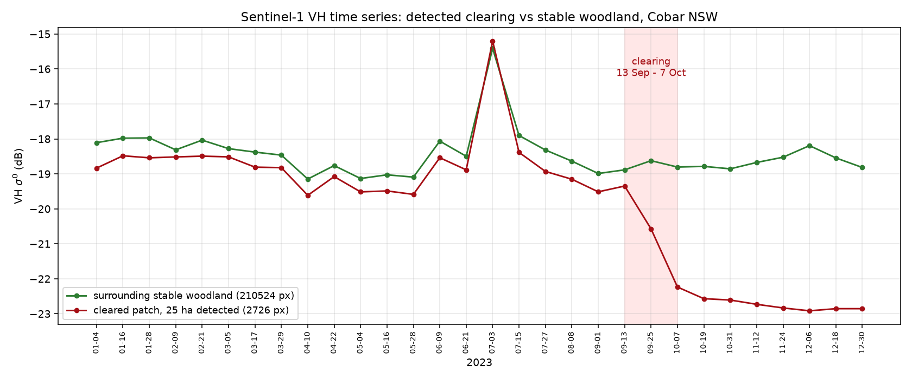
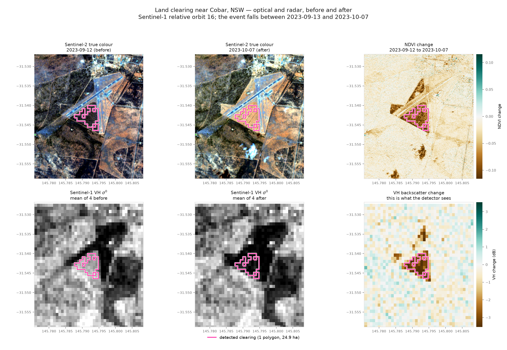
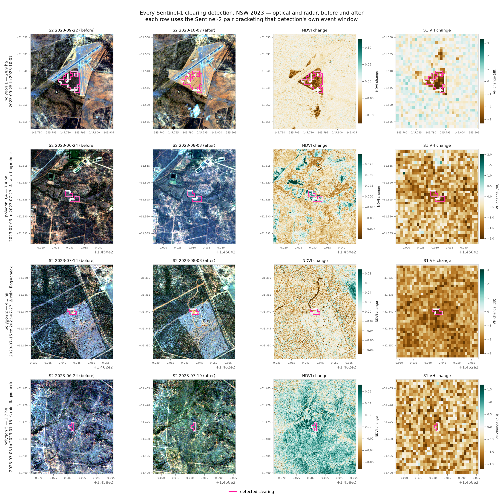

# Land-clearing detection from Sentinel-1 — NSW, Australia

Three runnable pipelines over New South Wales, all built on published,
peer-reviewed change-detection algorithms rather than new ones. One runs locally
with nothing but Python; two run server-side in Google Earth Engine. No bulk
downloads and no SNAP preprocessing in any of them.

| Pipeline | Algorithm | Runs on | Use it when |
| --- | --- | --- | --- |
| [`local_s1/`](local_s1/) | Sequential omnibus Wishart test, in numpy | **Nothing but Python** | You have no Earth Engine account, or want a self-contained reproducible run. This is the only pipeline whose results below were actually executed. |
| [`omnibus_s1/`](omnibus_s1/) | Sequential omnibus Wishart test (Conradsen et al. 2016) | Earth Engine | You want the same method at scale over many AOIs, server-side |
| [`ccdc/`](ccdc/) | CCDC (Zhu & Woodcock 2014) on S1 + S2 stacks | Earth Engine | You need forest, woodland **and grassland** in one product |

## Status: what has actually been run

`local_s1/` has been executed end to end on real data and validated against a
clearing event near Cobar. `omnibus_s1/` and `ccdc/` are reviewed but
**unexecuted** -- they were written in an environment that could not
authenticate to Earth Engine. Treat them as untested until you run them.

### Validated detection, Cobar NSW, 2023

30 acquisitions, relative orbit 16, 89 m pixels. Detected a **24.98 ha patch at
(145.7917, -31.5427), first flagged 2023-09-25**.

Independently established from the imagery: a 33 ha patch at (145.7920,
-31.5431) that tracks surrounding woodland to within 0.3 dB for nine months,
then drops 3.5 dB between 13 September and 7 October and stays down. The
detection lands **60 m away** -- under one pixel -- in the correct interval.



Sentinel-2 confirms it independently. `local_s1/sentinel2.py` pulls cloud-free
L2A chips from the public Google Cloud mirror (also anonymous), screening cloud
with the SCL band **over the chip** rather than the granule -- a scene can be
40% cloudy overall and clear across 3 km. The nearest clear pair, 12 September
and 7 October 2023, brackets the radar event window almost exactly: vegetated
before, bare after.

```bash
python -m land_clearing.local_s1.compare_figure fin_cobar_town \
    --lon 145.79195 --lat -31.54282 \
    --polygons shapefiles/nsw_clearing_2023.geojson --out compare.png
```



Two things that figure makes plain. The NDVI panel is washed brown across the
*whole* chip -- September to October drying in western NSW -- so an optical
threshold alone would flag the entire scene; the cleared patch is separable only
because its loss is far deeper than the seasonal background. And the site sits
immediately beside an airstrip (the location matches Cobar Airport), so this
particular event is plausibly airfield vegetation management rather than
agricultural clearing. The detector found a real clearing event; what the
clearing was *for* is not something backscatter can tell you.

### Optical verification of every detection

Each of the four detection sites was checked against its own cloud-free
Sentinel-2 pair, bracketing that site's own break interval:



| Site | Area | Window | rain_flag | Optical verdict |
| --- | --- | --- | --- | --- |
| polygon 1 | 24.9 ha | 25 Sep - 7 Oct | ok | **Confirmed.** Discrete NDVI collapse and localised VH drop, both matching the polygon. Vegetated before, bare after. |
| polygons 3, 4 | 7.4 ha | 3 - 27 Jul | check | Rejected. VH fell across the entire chip, not at the polygon; no discrete NDVI patch. |
| polygon 2 | 4.1 ha | 15 - 27 Jul | check | Rejected. Same area-wide VH decline; nothing discrete at the polygon. |
| polygon 5 | 2.7 ha | 3 - 15 Jul | check | Rejected, and contradicted: NDVI *rose* across the chip while VH fell. Vegetation greening with soil drying is the opposite of clearing. |

**So 24.9 ha of the 39.1 ha detected is real clearing, and `rain_flag` predicted
every rejection.** The flag was derived from the radar alone, before any optical
data was fetched, so this is an independent confirmation that it works -- filter
on `rain_flag == 'ok'` and the four false positives disappear without losing the
true one.

That also sharpens the earlier caution about the July cluster. Those detections
are not merely uncertain; the optical says they are the early-July wet-to-dry
transition, and the omnibus test flagged them because a basin-wide drop in
backscatter is a real change, just not clearing.

| AOI | Woody | Raw negative change | Clearing | Patches |
| --- | --- | --- | --- | --- |
| `cobar_town` | 33,089 ha | 255 ha | **35.1 ha** | 4 |
| `cobar_e` | 39,134 ha | 254 ha | 3.4 ha | 1 |
| `cobar_ne` | 40,944 ha | 44 ha | 0.0 ha | 0 |
| `cobar_sw` | 39,929 ha | 4 ha | 0.0 ha | 0 |
| `pilliga` | 22,544 ha | 2,847 ha | 0.0 ha | 0 |

Full run parameters and per-interval breakdowns are in [`results/`](results/),
along with the detections as GeoJSON and a data dictionary for the attributes.

### Exporting polygons

```bash
python -m land_clearing.local_s1.vectorise fin_cobar_town fin_cobar_e \
    --outdir shapefiles --name nsw_clearing_2023
```

Writes a zipped ESRI Shapefile (with `.prj`), a GeoPackage and GeoJSON.
Geometry is EPSG:4326; areas are computed in EPSG:3577 (Australian Albers).
Two attributes carry most of the triage value:

* `persist` -- fraction of acquisitions after the break that stay 1 dB or more
  below the pre-break mean. Clearing is permanent so real events sit near 1.0,
  while a transient dip from rainfall recovers and scores low.
* `rain_flag` -- set to `check` when the AOI-wide woody median also fell more
  than 1 dB in the same interval, i.e. the whole area darkened at once. On the
  2023 runs this correctly flags the July detections, which coincide with a
  wet-to-dry transition, while leaving the validated September event clear.

See [`results/shapefile_data_dictionary.txt`](results/shapefile_data_dictionary.txt)
for every field.

Pilliga is instructive: 2,847 ha of raw negative change, none surviving. That
AOI is 46% grassland and cropland, where pasture and crop cycling produce real
backscatter drops. Restricting to woody cover and requiring three connected
pixels removes all of it.

**Read these numbers as a floor, not an accuracy figure.** Recall was measured
at 83% against a single event, with labels derived from the same imagery rather
than an independent source. Events under the 2 ha mapping unit are invisible
and partially-cleared paddocks get clipped. A defensible accuracy figure needs
SLATS.

## Why two

The omnibus test is excellent on woody vegetation and degrades on grassland,
for a reason worth being explicit about. It assumes every image is an
independent sample from a *stationary* distribution. Woody canopy is dominated
by volume scattering and is close to stationary, which is why the method works
so well there. Grassland is not: it has a strong phenological cycle, and its
backscatter is driven by soil moisture — a rain front can move VV by 2–3 dB in
a week. A test that flags *any* departure fires constantly on things that are
not clearing.

CCDC fits each pixel's own harmonic season + trend model and flags departures
from *that*, with the threshold set by the pixel's own fitted RMSE. A noisy
grassland pixel gets a wider tolerance than a stable woodland pixel,
automatically. That is what makes one product across all three cover types
possible.

They are complementary, not redundant: where both fire on the same woody pixel,
you have two independent methods agreeing.

## The honest limit on grassland

**Sentinel-1 alone cannot establish grassland conversion, whatever the
algorithm.** Grassland has almost no volume scattering to lose. Ploughing
changes surface roughness, and the resulting backscatter change can go *either
way* depending on soil moisture, residue cover and row direction relative to
the look azimuth. The direction cue that makes woody clearing unambiguous is
simply absent.

So the CCDC pipeline requires Sentinel-2 evidence for grassland — an NDVI drop
*and* a bare-soil-index rise — and uses radar only as corroboration. Run it with
`--sensors s1` and grassland is reported as **zero**, which means *not
assessable*, not *no clearing*. The CLI warns when you do this.

## Layout

```
local_s1/     catalog.py (AWS scene discovery), annotation.py (geolocation grid
              + calibration LUT), reader.py (geocoded windowed reads),
              worldcover.py, omnibus_np.py (numpy algorithm), run.py, figures.py
common/       AOI presets, woody masks and cover strata, area stats, validation
omnibus_s1/   omnibus.py (algorithm core, ported verbatim), s1.py, clearing.py, detect.py
ccdc/         collections.py (S1/S2 stacks), segmentation.py, rules.py, detect.py
notebooks/    nsw_omnibus_s1.ipynb, nsw_ccdc_multicover.ipynb
tests/        offline checks that need no Earth Engine credentials
```

## Running without Earth Engine

`local_s1/` reads ESA Sentinel-1 GRD straight from the public AWS mirror, which
lists and serves **anonymously** -- no credentials, no requester-pays. The
measurement rasters are ~600 MB but internally tiled at 1024x1024, so a small
AOI window is an HTTPS range read of a few MB in about a second. ESA WorldCover
comes from its own public bucket the same way. Nothing is downloaded in full.

```bash
pip install -r land_clearing/requirements.txt
python -m land_clearing.local_s1.run --bbox 145.75 -31.60 145.95 -31.40 \
    --start 2023-01-01 --end 2024-01-01 --orbit 16 \
    --multilook 8 --min-mmu-ha 2 --outdir out_cobar
python -m land_clearing.local_s1.figures out_cobar
```

### Choosing --multilook

This is the parameter that decides whether the detector works. At 10 m the
per-pixel speckle standard deviation is ~2.1 dB, which swamps the 1-2 dB step
that clearing sparse woody vegetation produces. Measured against the Cobar
event, at alpha=0.01:

| multilook | pixel | ENL | recall | false positive |
| --- | --- | --- | --- | --- |
| 1 | 11 m | 4.40 | 26.0% | 0.24% |
| 3 | 33 m | 6.17 | 30.4% | 0.11% |
| 5 | 56 m | 8.78 | 57.5% | 0.22% |
| 8 | 89 m | 11.35 | 83.3% | 0.18% |

Recall triples while false positives fall -- the signature of a purely
speckle-limited problem. 8 is calibrated for sparse mulga and chenopod scrub;
closed-canopy clearing gives a much larger step and needs far less smoothing,
so the default is 5.

Two traps worth knowing about:

* **ENL is not nominal x N^2.** GRD is posted at 10 m from ~20 m resolution, so
  neighbouring pixels are correlated and 5x5 measures ENL ~15, not 110.
  Assuming 110 makes the test treat speckle as signal. The calibrated table is
  used by default; `--estimate-enl` estimates per AOI but is scene dependent
  (it inflates over homogeneous ground, and once produced 27,860 ha of
  "clearing" in stable woodland).
* **The mapping unit must exceed a pixel.** At 89 m a pixel is 0.79 ha, so the
  0.5 ha default would silently stop enforcing spatial coherence. That
  coherence requirement is what turns a 0.18% per-pixel false-positive rate
  into a near-zero patch-level one. `run.py` warns if the MMU falls under two
  pixels.

`--normalise` rescales each date to a common level over the woody baseline,
removing basin-wide moisture shifts. Off by default: measured against the Cobar
event it cut recall from 83% to 14% while taking rain-driven false positives
only from 0.1% to 0.0%.

## Setup

```bash
pip install -r land_clearing/requirements.txt
earthengine authenticate
```

You need an Earth Engine account and a Cloud project with the Earth Engine API
enabled. Run everything from the repository root.

## Run

Multi-cover (CCDC):

```bash
python -m land_clearing.ccdc.detect --aoi hay \
    --start 2023-01-01 --end 2024-01-01 --project your-gee-project
```

Woody only (omnibus):

```bash
python -m land_clearing.omnibus_s1.detect --aoi moree \
    --start 2023-01-01 --end 2024-01-01 --project your-gee-project
```

Both write a JSON summary and accept `--export drive` or
`--export asset --asset-folder projects/<p>/assets`.

### CCDC options worth knowing

| Flag | Default | Notes |
| --- | --- | --- |
| `--history-years` | `2.0` | History before `--start` used to fit the model. Below ~1.5 the harmonics are unreliable. |
| `--sensors` | `both` | `s1` cannot assess grassland; `s2` loses the direction constraint that makes woody detection specific. |
| `--min-observations` | `4` | Consecutive off-model observations to confirm a break. CCDC's own default of 6 assumes Landsat's 16-day revisit. |
| `--multilook-px` | `3` | Boxcar multi-look on S1. Speckle inflates the fitted RMSE, which raises the break threshold and costs sensitivity. |
| `--vh-drop-woody` | `-150` | VH magnitude threshold, dB × 100. So −1.5 dB. |
| `--ndvi-drop` / `--bsi-rise` | `-1500` / `800` | Index × 10000. So −0.15 NDVI and +0.08 BSI. |
| `--no-fire-screen` | off | By default, detections whose NBR fell past −0.30 are dropped as likely burns. |
| `--include-cropland` | off | Sown-crop cycles produce regular breaks that are not clearing. |
| `--min-mmu-ha` | `0.5` | Minimum mapping unit. Set `0` to see raw detections. |

Thresholds were chosen from the physical size of each effect, **not** tuned
against a reference. Calibrate them against SLATS for your AOI before quoting
numbers.

### AOI presets

`moree`, `walgett`, `collarenebri`, `narrabri` (Brigalow Belt South / north-west
cropping frontier), `pilliga` (woodland margin), `hay` (Riverina, grassland
dominated), `cobar` (western plains grassland / chenopod shrubland), `bombala`
(south-east forestry mix). Any other area: `--bbox W S E N`.

## Validation

```bash
python -m land_clearing.common.validation \
    --detected projects/<p>/assets/nsw_clearing_ccdc_hay_2023-01-01_2024-01-01 \
    --reference hansen --year 2023 --aoi hay
```

Hansen GFC is zero-setup but only meaningful for the **woody** strata — it is
tuned to closed-canopy forest, misses sparse woody cover, and says nothing
useful about grassland. Use it to sanity-check forest and woodland; ignore what
it implies about the rest.

For a defensible accuracy figure use **SLATS** (Statewide Landcover and Trees
Study) woody vegetation change from the NSW SEED portal at
<https://datasets.seed.nsw.gov.au/> — download the matching year, clip to the
AOI, upload as a GEE table asset, then pass `--reference asset
--reference-asset <table-asset>`. Note SLATS itself reports *woody* change, so
it validates the woody strata; grassland conversion has no equivalent
wall-to-wall NSW reference and needs field or high-resolution imagery checks.

## Known limitations

* **No radiometric terrain flattening.** `COPERNICUS/S1_GRD` is geometrically
  terrain corrected but not radiometrically flattened. Series over steep terrain
  are noisier and will over-detect. Flat inland AOIs behave best, which is also
  where most NSW clearing happens.
* **CCDC on radar is less trodden ground.** The algorithm and its GEE
  implementation are data-agnostic, but the published validation is
  overwhelmingly Landsat. Treat the S1 stack as the less-established half.
* **Fire.** The NBR screen is first-order. Separating fire from clearing
  properly needs a burnt-area product as an explicit exclusion layer.
* **Sparse woody baselines.** ESA WorldCover under-maps very sparse western NSW
  woody cover, so some woodland is stratified as grassland and then held to the
  stricter optical rule.
* **Timing resolution** is the acquisition cadence of the chosen S1 track
  (6–12 days) or the cloud-free S2 revisit, plus the `--min-observations`
  confirmation lag.

## Shortlist that was considered

| Repo | Method | Verdict for NSW |
| --- | --- | --- |
| [GEE CCDC](https://www.frontiersin.org/journals/climate/articles/10.3389/fclim.2020.576740/full), tooling in [`parevalo/gee-ccdc-tools`](https://github.com/parevalo/gee-ccdc-tools) | Harmonic season + trend, break on model residuals | **Chosen for multi-cover.** Built for land-cover change generally, self-calibrating per pixel, native to GEE and data-agnostic. |
| [`mortcanty/eesarseq`](https://github.com/mortcanty/eesarseq) | Sequential omnibus Wishart test | **Chosen for woody.** Peer-reviewed, unsupervised, dated and directed changes. Upstream has no LICENSE file, so this repo uses the Apache-2.0 tutorial source of the same algorithm. |
| [`bfast2`](https://github.com/bfast2) | Season + trend break monitoring | Same principle as CCDC and better established on SAR, but runs offline — you would pull per-pixel series out of GEE first. Better for a rigorous pixel study, worse for a whole-AOI demo. |
| [`jreiche/bayts`](https://github.com/jreiche/bayts) | Bayesian time-series fusion; basis of RADD alerts | Strongest deforestation-specific option, but R, and its forest/non-forest densities are parameterised for closed tropical forest. Woody only by construction. |
| [`ecovision-uzh/BraDD-S1TS`](https://github.com/ecovision-uzh/BraDD-S1TS) | Attention network on S1 time series | Trained on the Brazilian Amazon; applying it to NSW is a domain-shift research question. |
| [`bonlieuguillaume/vigisar`](https://github.com/bonlieuguillaume/vigisar) | Bi-temporal dissimilarity + tiled Otsu | Early-stage, no licence, bi-temporal only, expects GeoTIFFs you produce yourself. |
| [`CNES/S1Tiling`](https://github.com/CNES/S1Tiling) | S1 ARD preprocessing | Not a detector — the preprocessing layer the local-file options would need. |

## References

* Z. Zhu, C. E. Woodcock (2014). Continuous change detection and classification
  of land cover using all available Landsat data. *RSE* 144, 152–171.
* P. Arévalo et al. (2020). A Suite of Tools for Continuous Land Change
  Monitoring in Google Earth Engine. *Frontiers in Climate* 2, 576740.
* K. Conradsen, A. A. Nielsen, H. Skriver (2016). Determining the Points of
  Change in Time Series of Polarimetric SAR Data. *IEEE TGRS* 54(5), 3007–3024.
* Earth Engine Community tutorial, *Detecting Changes in Sentinel-1 Imagery*,
  parts 1–4 (Apache-2.0), <https://github.com/google/earthengine-community>.
